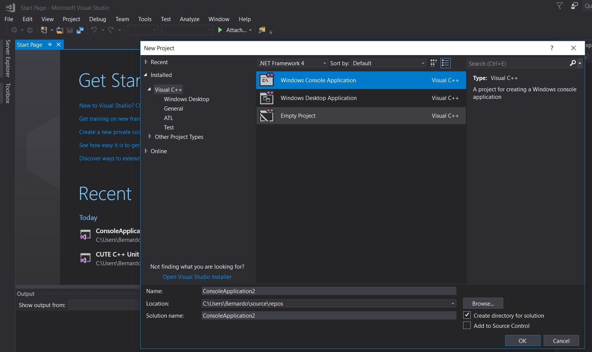
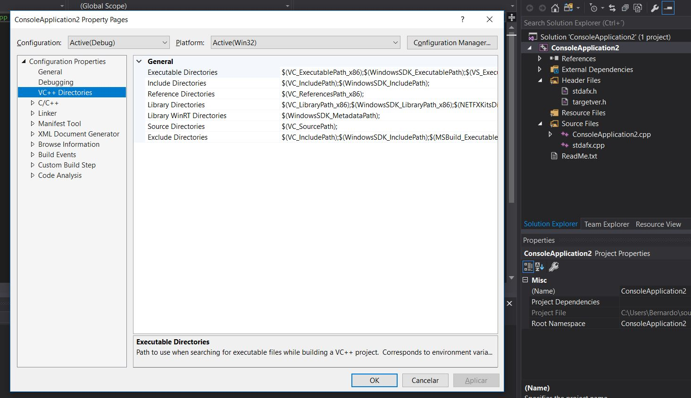
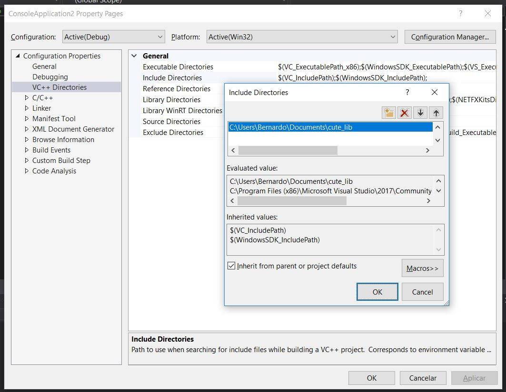

# CUTE Library on Visual Studio
CUTE is an easy to use C++ unit testing framework that leverages modern C++ libraries and features. 
Visual Studio is a cross-platform IDE multi-language made by Microsoft.
CUTE has, currently, an Eclipse plugin that is easy to install and use. 
This simple project aims to beginners integrate one template project with CUTE test in Visual Studio.

The following tutorial was made and test with the following software:
* Visual Studio Community 2017 Version 15.3.3
* CUTE Standalone v2.0.0

## Table of Contents
1. [Requirements](#requirements)
2. [Download & Extract CUTE](#download-extract-cute)
3. [Create & Configure Project](#create-configure-project)

## Requirements

For this to work, we need to install the following programs:
* [Visual Studio](https://www.jetbrains.com/clion/)
* [CUTE Standalone](http://cute-test.com/projects/cute/wiki/CUTE_Standalone)

## Download & Extract CUTE 

1. Download CUTE from the [website](http://cute-test.com/projects/cute/wiki/CUTE_Standalone).
1. Extract. 
1. Copy cute_lib to a directory of your choosing, e.g. "C:\Users\Username\Documents\"

## Create & Configure Project

* Create new "Windows Console Application" project.

* Right-click on the project name in the solution explorer (in this case is "ConsoleApplication2") and click on properties.
* Select the "VC++ Directories" tab.

* Edit the "Include Directories" property and add the cute_lib folder extracted earlier.

* Now everything should work!

If something goes wrong or is hard to understand, be sure to contact us at [ni@aefeup.pt](mailto:ni@aefeup.pt), message us on [Facebook](www.facebook.com/niaefeup) or submit a pull request here!