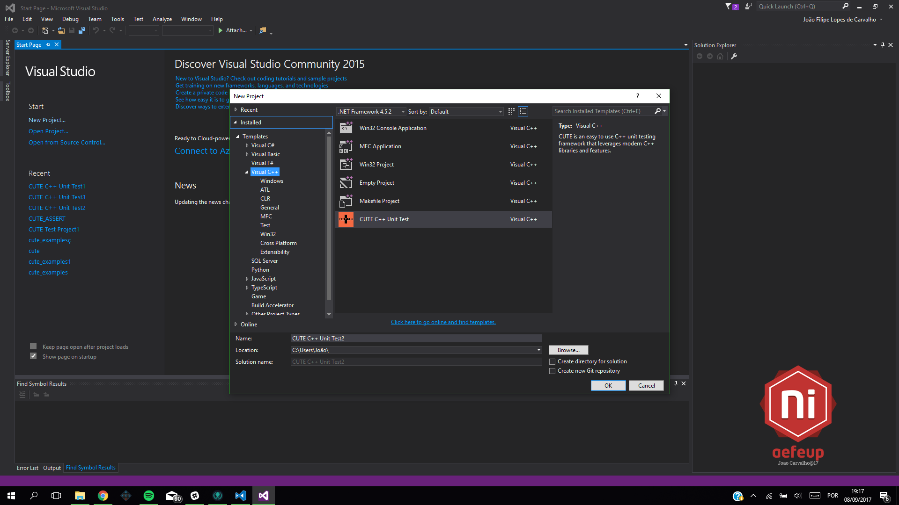
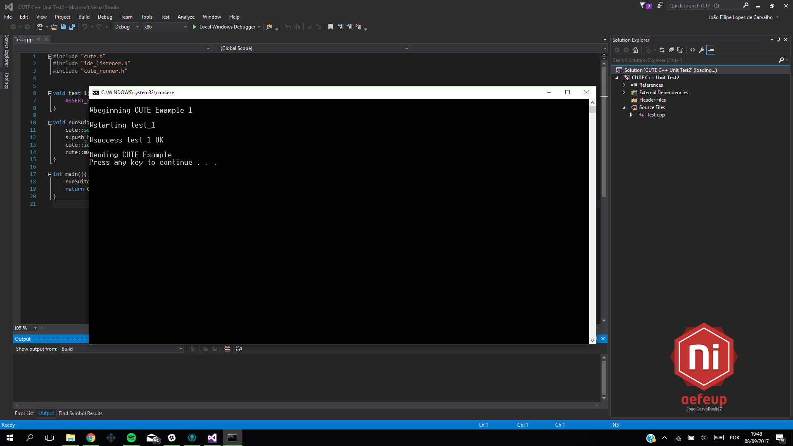

# CUTE Library on Visual Studio
CUTE is an easy to use C++ unit testing framework that leverages modern C++ libraries and features. 
Visual Studio is a cross-platform IDE multi-language made by Microsoft.
CUTE has, currently, an Eclipse plugin that is easy to install and use. 
This simple project aims to beginners integrate one template project with CUTE test in Visual Studio.

The following tutorial was made and test with the following software:
* Visual Studio Community 2015 Version 14.0.25425.01 Update 3
* CUTE Standalone v2.0.0

If something goes wrong or is hard to understand, be sure to contact us at [ni@aefeup.pt](mailto:ni@aefeup.pt), message us on [Facebook](www.facebook.com/niaefeup) or submit a pull request here!

## Table of Contents
1. [Requirements](#requirements)
2. [First Step - Copy cute folder to the right place](#First Step - Copy cute folder to the right place)
3. [Second Step - Install template project](#Second Step - Install template project)
4. Finnish

## Requirements

For this to work, we need to install the following programs:
* [Visual Studio](https://www.jetbrains.com/clion/)
* [CUTE Standalone](http://cute-test.com/projects/cute/wiki/CUTE_Standalone)

## First Step - Copy cute folder to the right place

You need to copy entire folder "cute" to your root of C disk (C:/cute)

## Second Step - Install template project

Now you need to install the template project. For this you just need to copy the file "CUTE C++ Unit Test.zip" to your Visual Studio project templates folder. Should be something like this: "C:\Users\($personal_folder)\Documents\Visual Studio 2015\Templates\ProjectTemplates".

After this you should be able to create a new project in Visual Studio and be able to run cute test.

